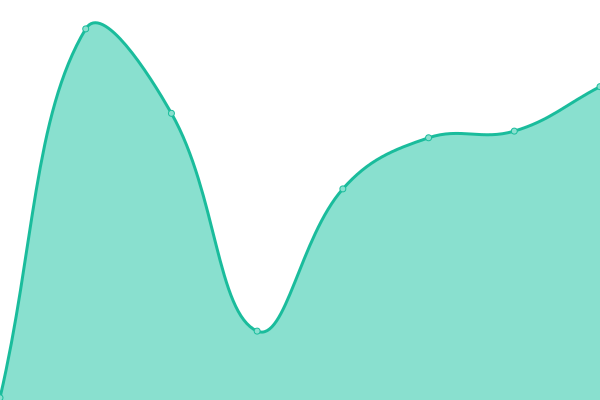
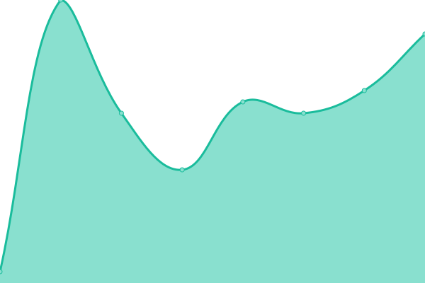

# [📈 Live Status](https://status.netic360.com): <!--live status--> **🟥 Complete outage**

This repository contains status page for [NETIC360](www.netic.io).

We use [Issues](https://github.com/neticgroup/status/issues) as incident reports, [Actions](https://github.com/neticgroup/status/actions) as uptime monitors, and [Pages](https://status.netic360.com) for the status page.

<!--start: status pages-->
<!-- This summary is generated by Upptime (https://github.com/upptime/upptime) -->
<!-- Do not edit this manually, your changes will be overwritten -->
<!-- prettier-ignore -->
| URL | Status | History | Response Time | Uptime |
| --- | ------ | ------- | ------------- | ------ |
|  [NETIC 360 FrontEnd](https://netic.app/login) | 🟥 Down | [netic-360-front-end.yml](https://github.com/neticgroup/status/commits/HEAD/history/netic-360-front-end.yml) | 

 116ms
     
 | 

<a href="https://status.netic360.com/history/netic-360-front-end">97.14%</a>
    

|  [NETIC 360 API](https://netic.app/api) | 🟥 Down | [netic-360-api.yml](https://github.com/neticgroup/status/commits/HEAD/history/netic-360-api.yml) | 

 14ms
     
 | 

<a href="https://status.netic360.com/history/netic-360-api">98.55%</a>
    

<!--end: status pages-->

[**Visit our status website →**](https://status.netic360.com)

## 📄 License

- Code: [MIT](./LICENSE) © [NETIC](www.netic.io)
- Data in the `./history` directory: [Open Database License](https://opendatacommons.org/licenses/odbl/1-0/)
